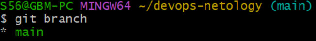
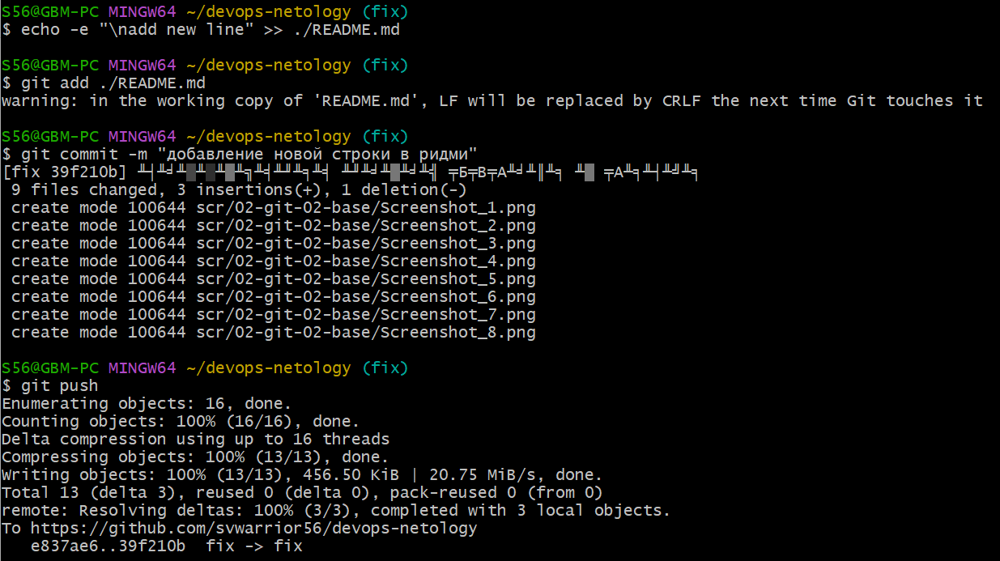

# Домашнее задание к занятию «Основы Git» - GIT-FOPS-27 - Васильев Сергей

Т.к. при сдаче предыдущего задания скриншоты выполнения вызывали вопросы, я беру на себя смелость публиковать их внутри задач, сразу после указаний.  
Думается, так читать их будет проще и удобнее.

# Задание 1. Знакомимся с GitLab и Bitbucket
Из-за сложности доступа к Bitbucket в работе достаточно использовать два репозитория: GitHub и GitLab.

Иногда при работе с Git-репозиториями надо настроить свой локальный репозиторий так, чтобы можно было отправлять и принимать изменения из нескольких удалённых репозиториев.

Это может понадобиться при работе над проектом с открытым исходным кодом, если автор проекта не даёт права на запись в основной репозиторий.

Также некоторые распределённые команды используют такой принцип работы, когда каждый разработчик имеет свой репозиторий, а в основной репозиторий пушатся только конечные результаты работы над задачами.

## GitLab
Создадим аккаунт в GitLab, если у вас его ещё нет:

1. GitLab. Для регистрации можно использовать аккаунт Google, GitHub и другие.
2. После регистрации или авторизации в GitLab создайте новый проект, нажав на ссылку Create a projet. Желательно назвать также, как и в GitHub — devops-netology и visibility level, выбрать Public.
3. Галочку Initialize repository with a README лучше не ставить, чтобы не пришлось разрешать конфликты.
4. Если вы зарегистрировались при помощи аккаунта в другой системе и не указали пароль, то увидите сообщение: You won't be able to pull or push project code via HTTPS until you set a password on your account. Тогда перейдите по ссылке из этого сообщения и задайте пароль. Если вы уже умеете пользоваться SSH-ключами, то воспользуйтесь этой возможностью (подробнее про SSH мы поговорим в следующем учебном блоке).
5. Перейдите на страницу созданного вами репозитория, URL будет примерно такой: https://gitlab.com/YOUR_LOGIN/devops-netology. Изучите предлагаемые варианты для начала работы в репозитории в секции Command line instructions.
6. Запомните вывод команды git remote -v.

7. Из-за того, что это будет наш дополнительный репозиторий, ни один вариант из перечисленных в инструкции (на странице вновь созданного репозитория) нам не подходит. Поэтому добавляем этот репозиторий, как дополнительный remote, к созданному репозиторию в рамках предыдущего домашнего задания: git remote add gitlab https://gitlab.com/YOUR_LOGIN/devops-netology.git.
8. Отправьте изменения в новый удалённый репозиторий git push -u gitlab main.
9. Обратите внимание, как изменился результат работы команды git remote -v.

**Как изменить видимость репозитория в GitLab — сделать его публичным**
* На верхней панели выберите «Меню» -> «Проекты» и найдите свой проект.
* На левой боковой панели выберите «Настройки» -> «Основные».
* Разверните раздел «Видимость» -> «Функции проекта» -> «Разрешения».
* Измените видимость проекта на Public.
* Нажмите «Сохранить изменения».

## Bitbucket* (задание со звёздочкой)
Это самостоятельное задание, его выполнение необязательно.

Теперь необходимо проделать всё то же самое с Bitbucket.

1. Обратите внимание, что репозиторий должен быть публичным — отключите галочку private repository при создании репозитория.
2. На вопрос Include a README? отвечайте отказом.
3. В отличии от GitHub и GitLab в Bitbucket репозиторий должен принадлежать проекту, поэтому во время создания репозитория надо создать и проект, который можно назвать, например, netology.
4. Аналогично GitLab на странице вновь созданного проекта выберите https, чтобы получить ссылку, и добавьте этот репозиторий, как git remote add bitbucket ....
5. Обратите внимание, как изменился результат работы команды git remote -v.

Если всё проделано правильно, то результат команды git remote -v должен быть следующий:
> $ git remote -v
> bitbucket https://andreyborue@bitbucket.org/andreyborue/devops-netology.git (fetch)
> bitbucket https://andreyborue@bitbucket.org/andreyborue/devops-netology.git (push)
> gitlab	  https://gitlab.com/andrey.borue/devops-netology.git (fetch)
> gitlab	  https://gitlab.com/andrey.borue/devops-netology.git (push)
> origin	  https://github.com/andrey-borue/devops-netology.git (fetch)
> origin	  https://github.com/andrey-borue/devops-netology.git (push)

Дополнительно можете добавить удалённые репозитории по ssh, тогда результат будет примерно такой:
> git remote -v
> bitbucket	git@bitbucket.org:andreyborue/devops-netology.git (fetch)
> bitbucket	git@bitbucket.org:andreyborue/devops-netology.git (push)
> bitbucket-https	https://andreyborue@bitbucket.org/andreyborue/devops-netology.git (fetch)
> bitbucket-https	https://andreyborue@bitbucket.org/andreyborue/devops-netology.git (push)
> gitlab	git@gitlab.com:andrey.borue/devops-netology.git (fetch)
> gitlab	git@gitlab.com:andrey.borue/devops-netology.git (push)
> gitlab-https	https://gitlab.com/andrey.borue/devops-netology.git (fetch)
> gitlab-https	https://gitlab.com/andrey.borue/devops-netology.git (push)
> origin	git@github.com:andrey-borue/devops-netology.git (fetch)
> origin	git@github.com:andrey-borue/devops-netology.git (push)
> origin-https	https://github.com/andrey-borue/devops-netology.git (fetch)
> origin-https	https://github.com/andrey-borue/devops-netology.git (push)

Выполните push локальной ветки main в новые репозитории.

Подсказка: git push -u gitlab main. На этом этапе история коммитов во всех трёх репозиториях должна совпадать.

# Задание 2. Теги
Представьте ситуацию, когда в коде была обнаружена ошибка — надо вернуться на предыдущую версию кода, исправить её и выложить исправленный код в продакшн. Мы никуда не будем выкладывать код, но пометим некоторые коммиты тегами и создадим от них ветки.

Создайте легковестный тег v0.0 на HEAD-коммите и запуште его во все три добавленных на предыдущем этапе upstream.

Аналогично создайте аннотированный тег v0.1.

Перейдите на страницу просмотра тегов в GitHab (и в других репозиториях) и посмотрите, чем отличаются созданные теги.
в GitHub — https://github.com/YOUR_ACCOUNT/devops-netology/releases;
в GitLab — https://gitlab.com/YOUR_ACCOUNT/devops-netology/-/tags;
в Bitbucket — список тегов расположен в выпадающем меню веток на отдельной вкладке.

# Задание 3. Ветки
Давайте посмотрим, как будет выглядеть история коммитов при создании веток.

1. Переключитесь обратно на ветку main, которая должна быть связана с веткой main репозитория на github.

?! А мы итак там!  

2. Посмотрите лог коммитов и найдите хеш коммита с названием Prepare to delete and move, который был создан в пределах предыдущего домашнего задания.

3. Выполните git checkout по хешу найденного коммита.

4. Создайте новую ветку fix, базируясь на этом коммите git switch -c fix.

5. Отправьте новую ветку в репозиторий на GitHub git push -u origin fix.

6. Посмотрите, как визуально выглядит ваша схема коммитов: https://github.com/YOUR_ACCOUNT/devops-netology/network.

7. Теперь измените содержание файла README.md, добавив новую строчку.
8. Отправьте изменения в репозиторий и посмотрите, как изменится схема на
странице https://github.com/YOUR_ACCOUNT/devops-netology/network и как изменится вывод команды git log.

# Задание 4. Упрощаем себе жизнь
Попробуем поработь с Git при помощи визуального редактора.

1. В используемой IDE PyCharm откройте визуальный редактор работы с Git, находящийся в меню View -> Tool Windows -> Git.
2. Измените какой-нибудь файл, и он сразу появится на вкладке Local Changes, отсюда можно выполнить коммит, нажав на кнопку внизу этого диалога.
3. Элементы управления для работы с Git будут выглядеть примерно так:
4. Попробуйте выполнить пару коммитов, используя IDE.

добавление скринов с коммита

добавление файла 02-git-02-base.md и коммита

По ссылке можно найти справочную информацию по визуальному интерфейсу.

Если вверху экрана выбрать свою операционную систему, можно посмотреть горячие клавиши для работы с Git. Подробней о визуальном интерфейсе мы расскажем на одной из следующих лекций.

В качестве результата работы по всем заданиям приложите ссылки на ваши репозитории в GitHub, GitLab и Bitbucket.