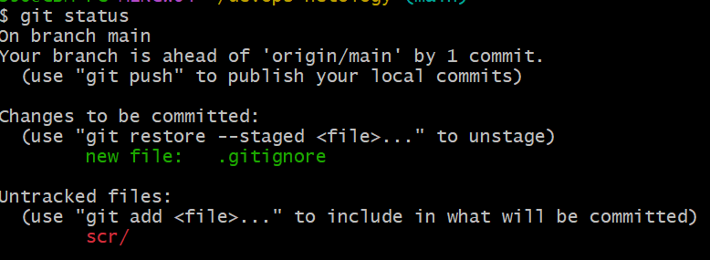

# Домашнее задание по лекции "Системы контроля версий" - GIT-FOPS-27 - Васильев Сергей

## Задание 1. 

Создать и настроить репозиторий для дальнейшей работы на курсе
В рамках курса вы будете писать скрипты и создавать конфигурации для различных систем, которые необходимо сохранять для будущего использования. Сначала надо создать и настроить локальный репозиторий, после чего добавить удалённый репозиторий на GitHub.

Создание репозитория и первого коммита
* Зарегистрируйте аккаунт на https://github.com/. Если предпочитаете другое хранилище для репозитория, можно использовать его. 
* Создайте публичный репозиторий, который будете использовать дальше на протяжении всего курса, желательное с названием devops-netology. Обязательно поставьте галочку Initialize this repository with a README. 
* Создайте авторизационный токен для клонирования репозитория. 
* Склонируйте репозиторий, используя протокол HTTPS (git clone ...). 
* Перейдите в каталог с клоном репозитория (cd devops-netology). 
* Произведите первоначальную настройку Git, указав своё настоящее имя, чтобы нам было проще общаться, и email (git config --global user.name и git config --global user.email johndoe@example.com). 
* Выполните команду git status и запомните результат. 
* Отредактируйте файл README.md любым удобным способом, тем самым переведя файл в состояние Modified. 
* Ещё раз выполните git status и продолжайте проверять вывод этой команды после каждого следующего шага. 
* Теперь посмотрите изменения в файле README.md, выполнив команды git diff и git diff --staged. 
* Переведите файл в состояние staged (или, как говорят, просто добавьте файл в коммит) командой git add README.md. 
* И ещё раз выполните команды git diff и git diff --staged. Поиграйте с изменениями и этими командами, чтобы чётко понять, что и когда они отображают. 
* Теперь можно сделать коммит git commit -m 'First commit'. 
* И ещё раз посмотреть выводы команд git status, git diff и git diff --staged. 

Создание файлов .gitignore и второго коммита

* Создайте файл .gitignore (обратите внимание на точку в начале файла), проверьте его статус сразу после создания. 
* Добавьте файл .gitignore в следующий коммит (git add...). 
* На одном из следующих блоков вы будете изучать Terraform, давайте сразу создадим соотвествующий каталог terraform и внутри этого каталога — файл .gitignore по примеру: https://github.com/github/gitignore/blob/master/Terraform.gitignore. 
* В файле README.md опишите своими словами, какие файлы будут проигнорированы в будущем благодаря добавленному .gitignore. 
* Закоммитьте все новые и изменённые файлы. Комментарий к коммиту должен быть Added gitignore. 

Эксперимент с удалением и перемещением файлов (третий и четвёртый коммит)

* Создайте файлы will_be_deleted.txt (с текстом will_be_deleted) и will_be_moved.txt (с текстом will_be_moved) и закоммите их с комментарием Prepare to delete and move. 
* В случае необходимости обратитесь к официальной документации — здесь подробно описано, как выполнить следующие шаги. 
* Удалите файл will_be_deleted.txt с диска и из репозитория. 
* Переименуйте (переместите) файл will_be_moved.txt на диске и в репозитории, чтобы он стал называться has_been_moved.txt. 
* Закоммитьте результат работы с комментарием Moved and deleted. 

Проверка изменения

* В результате предыдущих шагов в репозитории должно быть как минимум пять коммитов (если вы сделали ещё промежуточные — нет проблем): 
1. Initial Commit — созданный GitHub при инициализации репозитория.
2. First commit — созданный после изменения файла README.md.
3. Added gitignore — после добавления .gitignore.
4. Prepare to delete and move — после добавления двух временных файлов.
5. Moved and deleted — после удаления и перемещения временных файлов.

* Проверьте это, используя комманду git log. Подробно о формате вывода этой команды мы поговорим на следующем занятии, но посмотреть, что она отображает, можно уже сейчас. 

Отправка изменений в репозиторий

Выполните команду git push, если Git запросит логин и пароль — введите ваши логин и пароль от GitHub.

В качестве результата отправьте ссылку на репозиторий.

### Решение 1.

